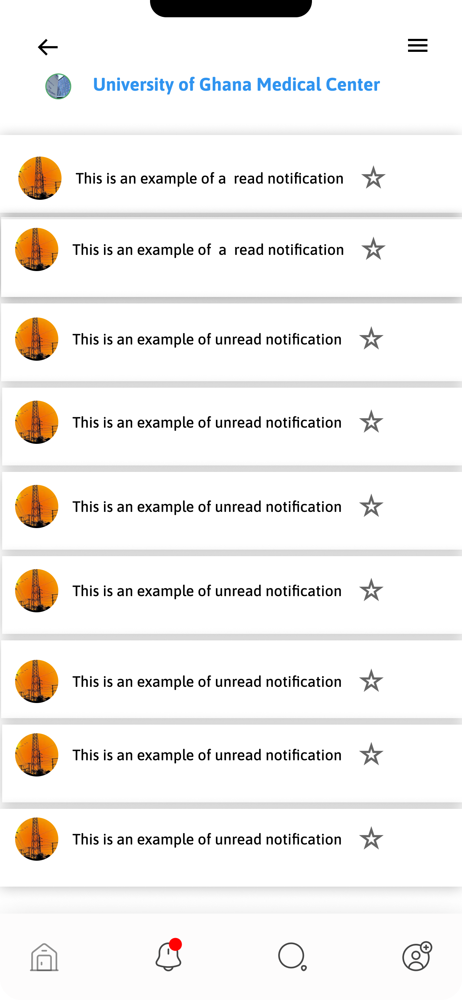
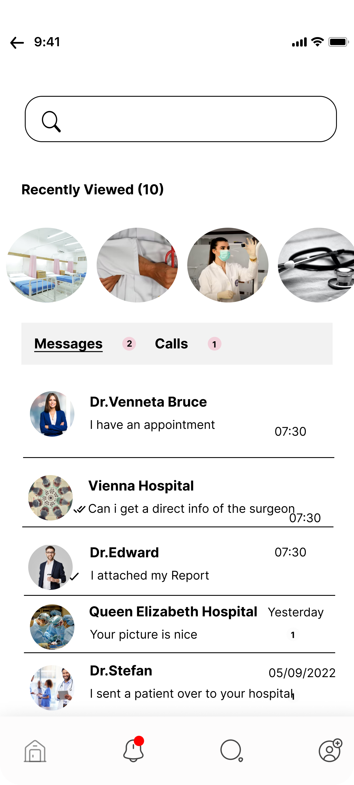
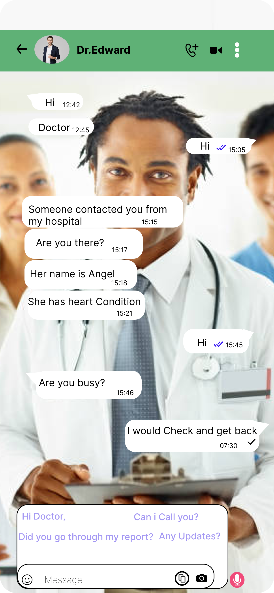

### Hi Fi
This is the final design of the Health Link Up app

Link to the app
[View the Figma Link](https://www.figma.com/file/fG8yeM3xOrUPJIX6h2zKTW/Health-Link-up?node-id=12%3A10&t=ybSisTr0Mq6pHn4d-1)
## Onboarding screens

## Log in Page

## Sign Up Page

## Home Page

## Hospital Profile

## Search Page

## Book Appointment Page

## Menu Page

## Notification Page

## Messages Screen

