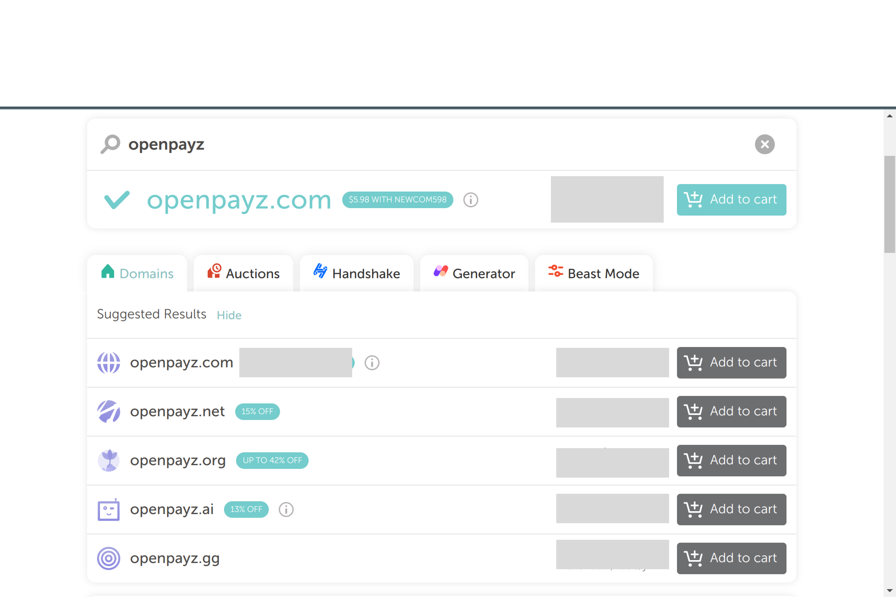
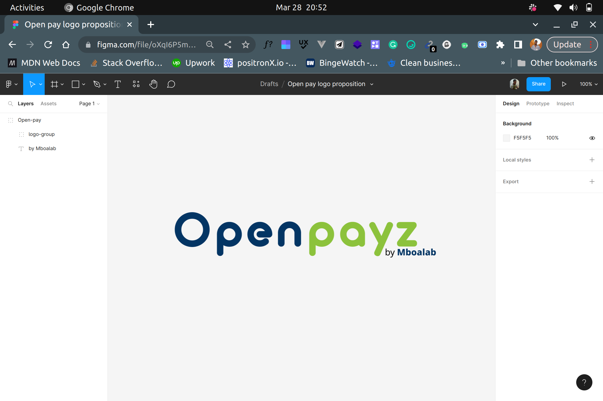
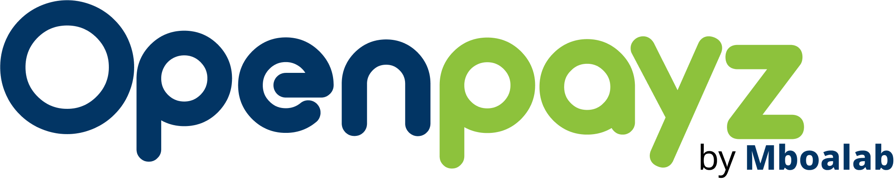
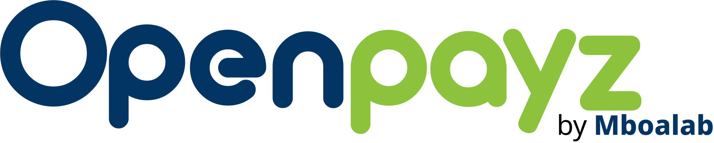
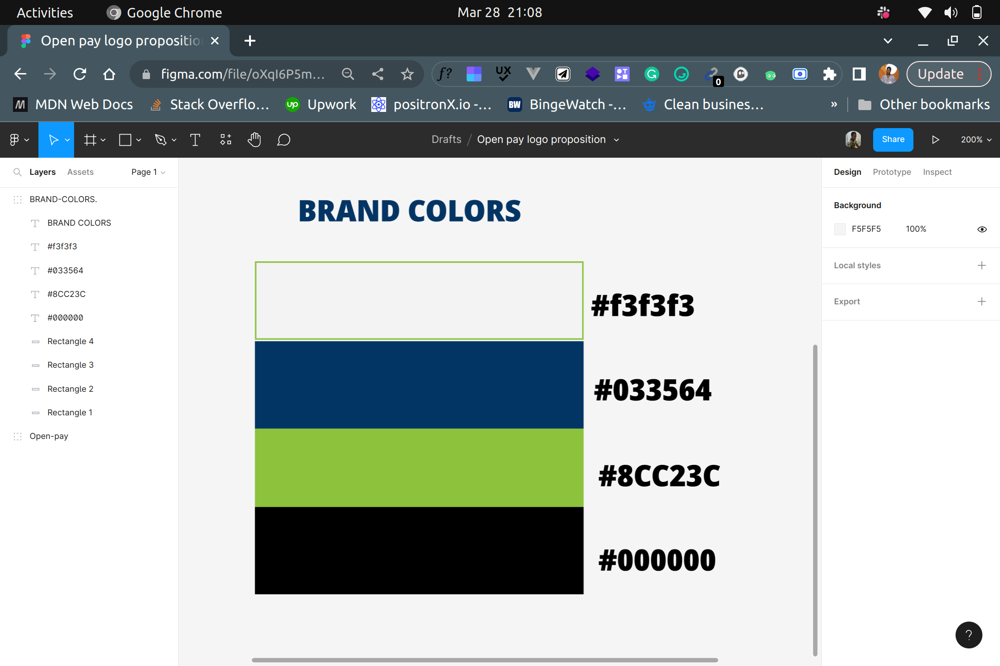
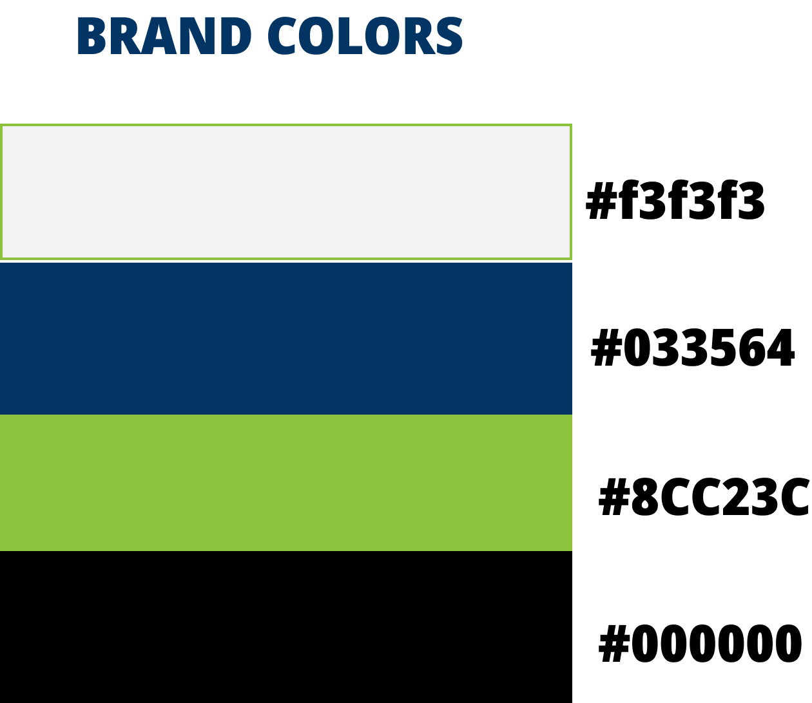

1. **Research on already existing similar solutions:**
 
 After doing research on different open source payment Technologies i came up with the most common strength and weaknesses of this technologies.

***Strengths***
    
    1. Transparency: Open source payment technology is transparent because the source code is available for anyone to inspect and audit. This increases the trust of users and helps ensure that the payment system is secure.

    2. Flexibility: Open source payment technology can be customized and modified to meet the specific needs of users. Developers can build on top of existing open source payment systems to create new features or functionalities.

    3.Security: Open source payment technology is often more secure than closed source alternatives because the code is available for anyone to review and identify vulnerabilities. This can help prevent security breaches and reduce the risk of fraud.

    4. Cost-effective: Open source payment technology is often free or low-cost, which makes it accessible to a wider range of users. This can help reduce transaction fees and increase the affordability of payment systems.

***Weaknesses***

    1. Complexity: Open source payment technology can be complex to set up and use, especially for non-technical users. This can lead to a steep learning curve and may require additional resources to ensure proper implementation.

    2. Lack of support: Some open source payment technology may not have dedicated support teams, which can make it difficult to resolve issues or receive assistance when needed.

    3. Limited adoption: Open source payment technology may not be as widely adopted as closed source alternatives, which can limit the number of merchants and users who accept it as a payment method.

    4. Regulatory challenges: Open source payment technology may face regulatory challenges in some jurisdictions, especially if it is perceived as a threat to traditional financial institutions. This can create legal hurdles and limit its potential adoption.

our main goal is to focus on this weaknesses and see how we can improve on them in every part or phase of our project implementation especially in the long term .

2. **Propose a genuine brand name:** 
>The brand name should be memorable, easy to pronounce, and reflective of the project's personality and values

How about ***"Openpayz"?*** 
 This name reflects the project's goal of addressing the scarcity of small change by using open-source technology to create a new way of making payments. The name is simple, easy to remember, and conveys a sense of innovation and change. Additionally, the name could be accompanied by a tagline such as ***"Small change, big impact"*** to further emphasize the project's mission
 
 Also needed to check if the name used for branding is unique and it has not yet been used by other businesses or organizations. i do this by checking on the domain name availability and apps on play store to make sure it doesnt match the exact name we are using for branding. and all the domains names are available as seen on image below

 

 source:namecheap.com

3. **Create a logo:** 
>A logo is a key element of the brand identity. It should be unique, memorable, and reflective of our brand's personality and values.

Propose logo for **Openpayz**

 
  
  

Below is the link to the Openpay Figma logo files 
[You can view the figma files here](https://www.figma.com/file/oXqI6P5mS6NWWbSq2R6va6/Open-pay-logo-proposition?node-id=0%3A1&t=vFr46V9w0wUOwIlY-1)

 4. **Propose a brand colors:** 
>Once validated, the brand colors will be consistent across all marketing and communication materials and reflect project's personality and values.

  
For the color scheme, I suggest using a combination of blue and green. Blue represents trust, security, and professionalism, while green represents growth, innovation, and sustainability. The shades of blue and green can be adjusted to fit your brand's personality and target audience.

Here is a possible color scheme for Openpayz:

    Primary color: #033564 (a medium to dark shade of blue)
    Secondary color: #8CC23C (a bright shade of green)
    Accent color: #f3f3f3 (a warm shade of white to add some energy and excitement to the brand)
Came up with some brand colors which was previously used in the creation of the the logo.

 

 

 Below is the link to the Openpay Brand colors figma file 
[You can view the figma files here](https://www.figma.com/file/oXqI6P5mS6NWWbSq2R6va6/Open-pay-logo-proposition?node-id=0%3A1&t=vFr46V9w0wUOwIlY-1)

