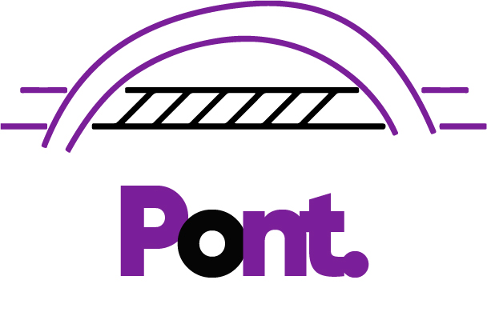

**There are several payment solutions that are similar to our project, or have features or initiatives that we can incorporate into our project and with several identifiable gaps in the market that can and will serve as opportunities to differentiate our proposition.**

1. [UPI 123pay](../Task-1/4-upi123pay.md)

>This Payment solution is in some way similar to the project that we at MboaLab are working on, especially because of the "Feature phones(mobile phones with fixed features)", which can be viewed as a miniaturised hardware device that has one specific use.

>User's being able to carry out transactions even without a smartphone or an active internet connection.
UPI 123Pay enables offline payments using feature phones; through a call-based system, customers set up their own IDs and create a verifiable PIN that will be used for future offline transactions.

>Feature phone users can conduct a variety of transactions based on four technological alternatives via UPI 123PAY; calling an IVR(interactive voice response) number, app functionality in feature phones, a missed call-based approach, and proximity sound-based payments.
UPI 123Pay is a giant leap forward towards mass inclusion and extension of digital payments in a secure manner to non-smartphone users. It democratises digital banking and removes dependence on the internet. Anyone, even with a simple feature phone, will now get access to digital banking.

>**UPI 123pay with Interactive Voice Response (IVR):**
If users wanted to use UPI payment using pre-defined IVR numbers, they would need to make a secure call from their feature phones to a specified number and complete UPI onboarding processes before they could begin performing financial transactions without an internet connection.

>**UPI 123pay through Missed Call:**
By dialling a missed call on the number displayed at the merchant's location, feature phone users will be able to access their bank account and perform routine transactions such as receiving or transferring funds, regular purchases, bill payments, and so on. The merchant will create a token with the customer's mobile number and the bill amount of his purchase at the time of billing. The customer can then make a missed call to the merchant's number, and they will receive an incoming call from 08071 800 800 asking them to authenticate the transaction by entering their UPI PIN.

>**UPI 123pay through functionality implemented by OEM(original equipment manufacturer):**
The digital solution is the UPI app for feature phones developed by Gupshup in collaboration with Airtel Payments Bank. In this case, interested solution providers will need to collaborate with feature phone mobile manufacturers (OEMs) to enable a native payment app written in embedded C. (or as supported). This UPI app has the look and feel of a smart phone app, but with the limitations of a feature phone. With the exception of Scan and Pay, it can currently offer the majority of UPI functionality. This one in particular is something we can look out since we will need a native app in our minituarised hardware device.

>**UPI 123pay through Proximity Sound-based payments:**
This is a solution for proximity sound-based payments developed in collaboration with Tonetag and supported by NSDL Payments Bank. Sound waves are used in the technology to enable contactless, offline, and proximity data communication on any device. Using ToneTag's VoiceSe payment solution, users can tap any phone to make UPI payments to merchants. The user dials 6366 200 200 and selects the Pay to Merchant option. They tap their phone on the merchant device (POD) and press # once the POD emits the distinctive tone. To complete the transaction, the user enters the amount to be paid, followed by their UPI PIN. The transaction status is acknowledged by the POD, and the user receives confirmation via the IVR call.

>Some of the ways of using this payment solution may be quite taxing on users, since the process involved in making a transaction might be a bit of a hassle; and we want our payment solution to be user-friendly and very  convenient to use. 
We can reduce complexity, simplify and consolidate a solution for local businesses. We're talking about an integrated payment processing technology to consolidate all payment processing functions under a single platform, making the payment processing experience faster, simpler.

>More details on [UPI 123pay](https://www.goodreturns.in/classroom/upi-123pay-what-is-upi-123pay-how-to-use-it-and-how-is-it-different-from-current-upi-interface-1269950.html)

2. [Mobile Point-of-Sale(mPOS) Systems](../Task-1/3-various-payment-solutions.md#2-mobile-point-of-salempos-systems)

>Mobile point of sale systems most commonly come to mind when discussing digital payments. mPOS systems work through smartphones, tablets, and other wireless devices to accept payments from anywhere.
Restaurants, retailers, and on the road service providers benefit the most from mPOS systems. They allow you to move with the device and accept payments wherever you need — both bank cards and mobile wallet payments.
Wireless devices allow business owners more flexibility. When social distancing came into place, those with mPOS devices could easily meet customers where they sit, limiting contact or gatherings of people at checkouts. These are not traditional card reader devices.

>In addition, most mPOS software solutions come with features that allow businesses to email receipts, track sales, inventory and even set up loyalty programs that go straight through the system. It’s a more convenient, modern way to accept payments, enhance the customer experience, and boost productivity.
Mobile POS systems are easy to adopt. Solutions providers like Stax integrate with a range of solutions to enable merchants to go mobile.

>Smartphones, Tablets or these wireless devices might be difficult for some Local Business owners to operate; again a simple, less complex and consolidated solution need to be put in place, but can also incorporate some features of the mPOS.

Our payment solution can also provide for a QR-Code method of payment, that can be scanned and used to make transactions like other payment solutions. Also, the minituarised device has to be easy to use, and with as little features as possible; also with only the number buttons available, and a button for "Send", a button for "Receive"(Where the mode of receiving can also be chosen with numbers; 1 for QR-code, 2 for Account Number/ID), an on and off button, and a button to track records/receipts or transaction histories. Just to make this Payment solution simple and alot more convenient to use by the local business owners and users.

Furthermore, one major gap many of these payment solutions fail to cover is the fact that, Physical customer service and Agents of these Payment solutions are usually absent or very far away from local communities. Hence, assistance or help can not be provided to people who encounter problems or want to onboard to the payment solution and need someone to put them through. Therefore, we need to make provision for having Agents present or close to various local communities to be able to assist users whenever there is a problem, or to help with onboarding.

I would have also suggested the incorporation of a Near-Field Communication (NFC) Technology feature as described in [Contactless Payments](../Task-1/3-various-payment-solutions.md#4-contactless-payments), but adding this technology might increase the cost of production of the hardware device; so I thought to leave this out, but I still wanted to talk about it, just in case.

Details on more limitations, weaknesses; market gaps that can be filled, will be found in a previous [article](../Task-1/2-limitations-in-adoption-of-payment-solutions.md) I wrote, and some suggestions on how to close those gaps and leverage on the market gaps to increase our proposition.

## Proposed Brand Name

### Pont.

The mission of our Payment solution is **"to solve the issue of small cash scarcity, especially in local communities, by bridging the gap between trust, inclusion and technological performance.** Since the main aim is to bridge, I thought of our brand name to be "Bridge", but "Bridge" is too common a name and might not be as easy to pronounce or as memorable. So I used the French translation of "Bridge" which is "Pont". Hence, the brand name I propose for this Project is **"Pont."**.

>**PONT is the French word for "Bridge".**

## Proposed Brand Logo and Color Scheme

The first proposed color scheme is **Purple**; **`#7B1F99`** and **Black**; **`#000000`**.

**Purple `#7B1F99` :** The color Purple gives a sense of wealth and luxury. It is also associated with royalty, creativity and imagination. Our payment solution has to be hassle-free and luxurious for our users.

**Black `#000000` :** Black is often associated with power, elegance and formality.

Below is the proposed Logo in conjunction with this color scheme.

The second proposed color scheme is **Red**; **`#B23F4E`** and **Dark-Green**; **`#244B43`**.

**Red `#B23F4E` :** The color Red is a very powerful and elegant color. Red in some parts of the world represent Prosperity and Happiness, and also attracts Good Luck. Our brand should represent happiness for our users and a force of Good Luck.

**Dark-Green `#244B43` :** Dark-Green is representative of Affluence, New Beginnings and Growth. It is stable and signifies Renewal and Abundance. It has a balancing and harmonizing effect; and "to harmonize" is, in some way synonymous to "to bridge".

And below is the proposed Logo in conjunction with this color scheme.

## Brand Overview

**Pont.** is an innovative financial technology company that enables seamless and hassle-free transactions across local communities. This is achieved by providing a system of different payment solutions that could enable people and businesses in local communities to carry out their daily transactions easily, receive payments instantly, send funds seamlessly and drive growth in local communities.

Pont. bridges local communities and businesses to frictionless transactions, it bridges the gap between local communities, financial inclusion and extension of digital payments. The local communities have been paid less attention regarding financial systems and technology because of lesser economic activities, and we believe they deserve to be fully included in the financial system.

Our mission is to solve the issue of small cash scarcity in local communities, by bridging the gap between trust, inclusion and technological performance; to be a support or pillar to local communities and businesses, to provide them with frictionless, secure and instant transactions, with a simple, cost-effective and convenient payment solution.

And our vision is to create economic opportunities and spark economic growth in local communities and to see an increase in the financial inclusion of local communities with digital payments.
