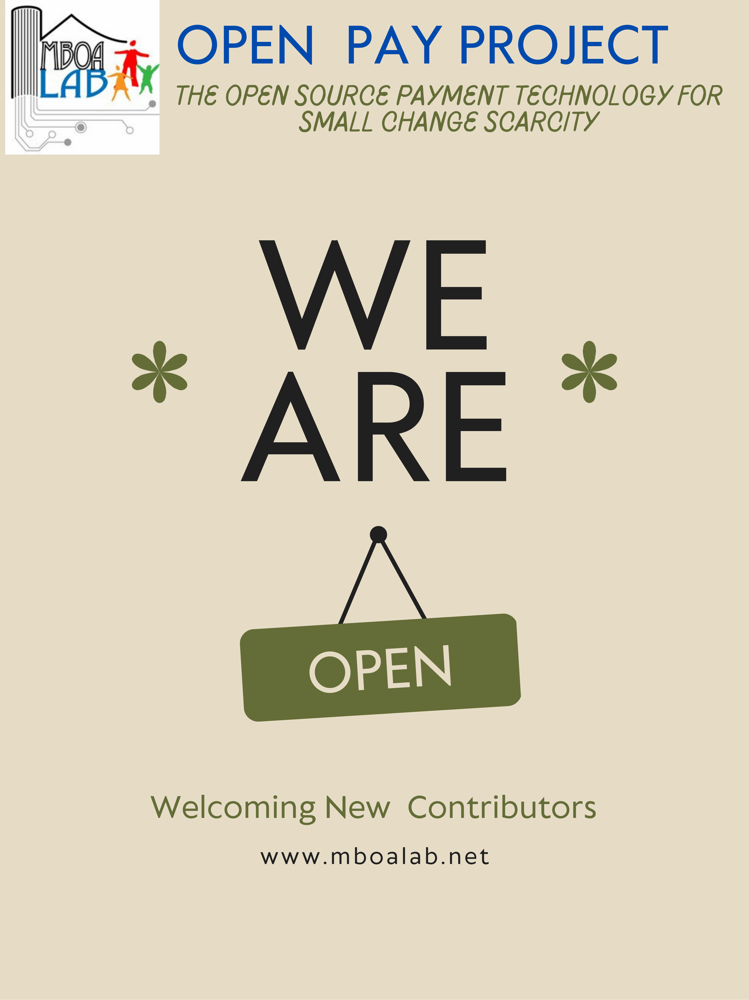

# Payment Solutions

Payment solutions are tools and systems that allow individuals and businesses to make and receive payments electronically. These solutions have become increasingly popular in recent years, as more and more transactions are being conducted online.
In this article, we will explore the different payment solutions available in the market and compare their advantages and disadvantages.There are several types of payment solutions available, including:

- Cash Payments
  Cash payments are the oldest and most traditional form of payment. They are widely accepted and easily accessible to most people. The advantages of cash payments are that they are easy to use, secure, and do not require any special equipment or technology. However, cash payments are not practical for online transactions, and there is a risk of theft or loss.

- Credit/Debit Card Payments
  Credit/debit card payments are widely used for both in-person and online transactions. They offer convenience, security, and rewards programs. Card issuers also offer fraud protection, which makes them more secure than cash payments. However, there are fees associated with card payments, and not all merchants accept them.

- Online Payments
  Online payments are becoming increasingly popular due to the rise of e-commerce. They offer convenience, speed, and security. Online payment solutions include PayPal, Stripe, and Square. These platforms offer features such as fraud protection, easy integration with e-commerce websites, and the ability to accept multiple forms of payment. However, online payments require an internet connection and a device capable of accessing the internet.

- Mobile Payments
  Mobile payments are similar to online payments, but they are made using a mobile device. Mobile payments use technologies such as NFC (near-field communication) and QR codes to facilitate transactions. Mobile payment solutions include Apple Pay, Google Pay, and Samsung Pay. Mobile payments offer convenience, speed, and security. However, they require a compatible mobile device and may not be accepted by all merchants.

- Digital Wallets
  Digital wallets are similar to mobile payments, but they can also store other forms of payment, such as credit/debit cards and loyalty cards. Digital wallets include Apple Wallet, Google Wallet, and Samsung Wallet. Digital wallets offer convenience, speed, and security. They also offer features such as budget tracking, loyalty program integration, and the ability to store boarding passes and event tickets. However, digital wallets require a compatible mobile device and may not be accepted by all merchants.

- Cryptocurrency Payments
  Cryptocurrency payments are a relatively new form of payment that uses blockchain technology to facilitate transactions. Cryptocurrency payments offer anonymity, security, and low fees. However, cryptocurrency is not widely accepted by merchants, and there is a risk of volatility in the value of cryptocurrency.
  '''
  In conclusion, payment solutions come in various forms, and each has its advantages and disadvantages. Choosing the right payment solution depends on the needs of the buyer and the seller, the security level required, and the acceptance by merchants. It is important to choose a payment solution that is secure, convenient, and widely accepted.
  '''

If you're interested in contributing to this project, we would love to hear from you! We're looking for individuals who are passionate about payment solutions and would like to share their expertise with others. You can contribute by writing blog posts, creating videos, or sharing your personal experience with different payment solutions. Please reach out to us if you're interested in getting involved!

[Open Pay Technical Documentation In progress](https://docs.google.com/document/d/173qUWFruyyT6a9UbDYJaHxjMIkbV-DzSCZg2l1mAV5k/edit?usp=sharing)

